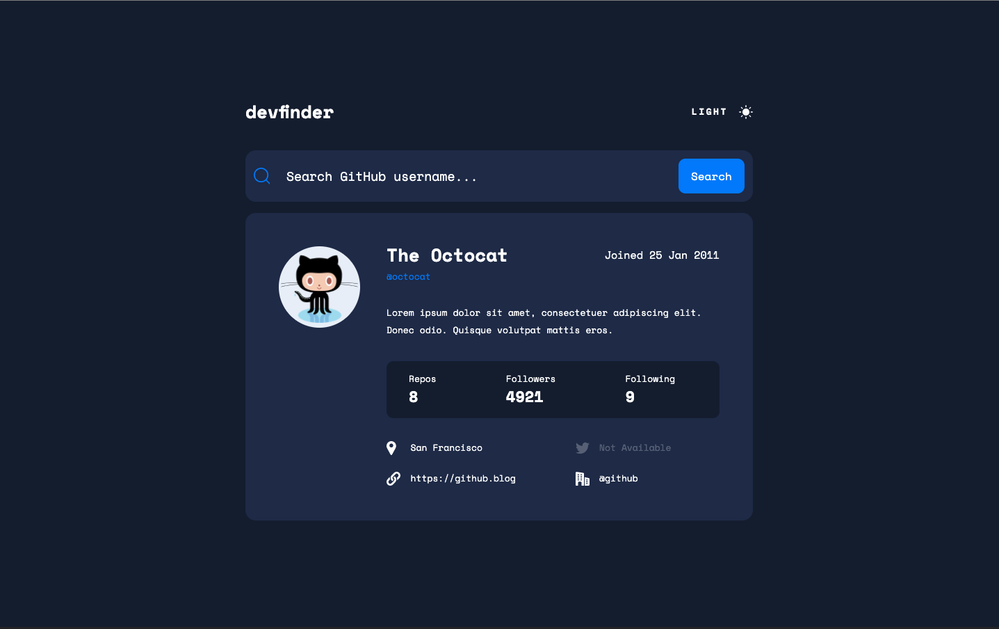

# Frontend Mentor - GitHub user search app solution

This is a solution to the [GitHub user search app challenge on Frontend Mentor](https://www.frontendmentor.io/challenges/github-user-search-app-Q09YOgaH6). Frontend Mentor challenges help you improve your coding skills by building realistic projects.

## Table of contents

- [Frontend Mentor - GitHub user search app solution](#frontend-mentor---github-user-search-app-solution)
  - [Table of contents](#table-of-contents)
  - [Overview](#overview)
    - [The challenge](#the-challenge)
    - [Screenshot](#screenshot)
    - [Links](#links)
  - [Built with](#built-with)
  - [Author](#author)

## Overview

### The challenge

Users should be able to:

- View the optimal layout for the app depending on their device's screen size
- See hover states for all interactive elements on the page
- Search for GitHub users by their username
- See relevant user information based on their search
- Switch between light and dark themes
- Have the correct color scheme chosen for them based on their computer preferences.

### Screenshot

### Links

- Solution URL: [https://www.frontendmentor.io/solutions/responsive-github-user-search-using-angulartypescriptrxjsscss-Q6DiQmvKlR](https://www.frontendmentor.io/solutions/responsive-github-user-search-using-angulartypescriptrxjsscss-Q6DiQmvKlR)
- Live Site URL: [https://moodyjw.github.io/fe-mentor-github-user-search/](https://moodyjw.github.io/fe-mentor-github-user-search/)
- GitHub Repo: [https://github.com/MoodyJW/fe-mentor-github-user-search](https://github.com/MoodyJW/fe-mentor-github-user-search)

## Built with

- Angular
- SCSS
- HTML

## Author

- Website - [Jason Walker Moody](https://moodyjw.github.io/portfolio-ng/home)
- Frontend Mentor - [@MoodyJW](https://www.frontendmentor.io/profile/moodyjw)
